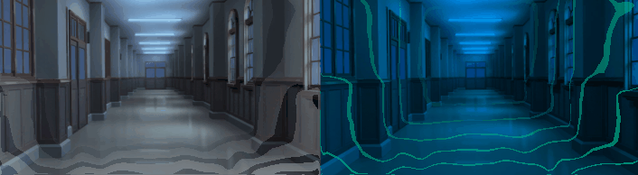

# SearchEffect

Unityで、画像の深度マップを元にサーチ風のエフェクトをかけるテストプロジェクトです。

深度マップのデータは以下のサイトを参考に作成しました。

https://dronebiz.net/tech/vfdm/m_challenge

## License

ソースコードはApache 2.0 Licenseです。  
画像に関しては[きまぐれアフター](https://k-after.at.webry.info/)様の[利用規約](http://www5d.biglobe.ne.jp/~gakai/HTML/kiyaku.html)をご参照ください。
